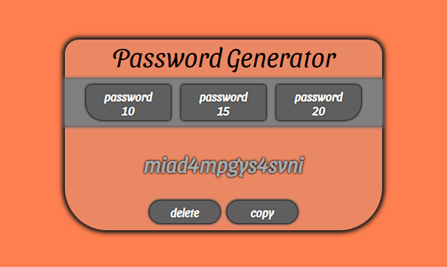

# Password-Generator

The password generator gives you the choice to choose the length of the random password (10, 15 or 20 elements).
You can copy the password by clicking on the copy button and also delete one with the delete button.
